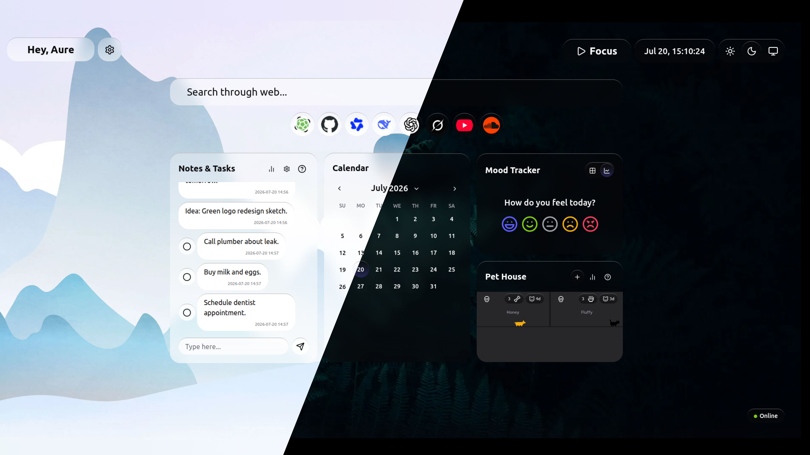

# Aure Homepage

A modern and customizable Chrome New Tab extension built with React, TypeScript, and Vite.

Aure Homepage replaces Chrome's default new tab with a clean, fast, and privacy-friendly dashboard designed to help you stay organized and productive.

---

## Screenshots

<p align="center">
  
</p>

---

## Features

### Search

- Fast Google search
- Command support
- Search suggestions
- Direct URL navigation

### Widgets

- Calendar
- Notes & Tasks
- Mood Tracker
- Pet House

### Features

- Focus Timer
- Favorite Sites
- Chrome Top Sites
- Network Status

### Personalization

- Light, Dark and System themes
- Multiple accent colors
- Wallpaper support
- Adjustable background blur
- Configurable widgets

### Data

- Local-first storage
- Import and export data
- Automatic update checking

---

## Installation

1. Download the latest release from the **Releases** page.
2. Extract the ZIP file.
3. Open `chrome://extensions`.
4. Enable **Developer mode**.
5. Click **Load unpacked**.
6. Select the extracted extension folder.

---

## Updating

1. Download the latest release.
2. Extract the ZIP file.
3. Open `chrome://extensions`.
4. Click **Load unpacked**.
5. Select the newly extracted extension folder.

Your data will be preserved as long as the extension ID remains the same.

---

## Tech Stack

- React 19
- TypeScript
- Vite
- Tailwind CSS v4
- Zustand
- Dexie (IndexedDB)
- Framer Motion
- React Hook Form
- Zod

---

## Development

Clone the repository:

```bash
git clone https://github.com/alizs10/aure-homepage-chrome-extension.git
```

Install dependencies:

```bash
bun install
```

Start the development server:

```bash
bun run dev
```

Build the extension:

```bash
bun run build
```

---

## Storage

Aure Homepage stores all data locally.

- IndexedDB (Dexie) is used for widgets and user content.
- Chrome Storage is used for application settings and the focus timer.

No user data is sent to external servers.

---

## Storage

Aure Homepage stores all user data locally.

- IndexedDB (Dexie) is used for widgets and user content.
- Chrome Storage is used for application settings, the focus timer, and cached website favicons.

No user data is sent to external servers.

---

## Permissions

Aure Homepage requests only the permissions required for its features.

### Chrome Permissions

| Permission | Purpose |
| ---------- | ------- |
| `storage` | Saves application settings, the focus timer, and cached website favicons. |
| `topSites` | Displays your most frequently visited websites on the homepage. |

### Host Permissions

| Host | Purpose |
| ---- | ------- |
| `https://suggestqueries.google.com/*` | Retrieves Google search suggestions while typing. |
| `https://www.google.com/s2/*` | Retrieves website favicons used throughout the extension. |
| `https://*.gstatic.com/*` | Allows loading favicon assets returned by Google's favicon service. |
| `https://raw.githubusercontent.com/alizs10/*` | Checks for extension updates by downloading the latest `version.json`. |

Website favicons are cached locally after the first download to reduce loading time and network requests.

Aure Homepage does **not** request access to all websites (`<all_urls>`). It only requests access to the specific domains required for its functionality. All requested permissions can be verified in the project's `manifest.json`.

## Roadmap

- Chrome Web Store release
- Additional widgets
- More themes and wallpapers
- Widget customization

---

## Support the Project

Aure Homepage is developed and maintained in my spare time. If you'd like to support future development, you can make a donation using the wallet below.

**USDT Wallet (TRC20)**

```text
TXN3jwjz3eyFEDmk3bpbrsW8eJnChNBuzS
```

Support is completely optional, but every contribution is greatly appreciated.

---


## License

MIT