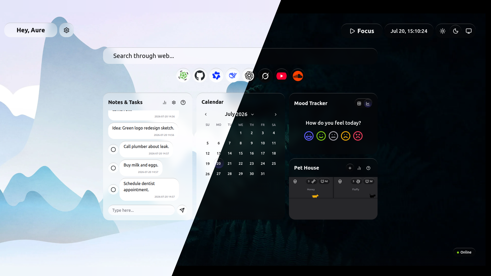

# Aure Homepage

A modern and customizable Chrome New Tab extension built with React, TypeScript, and Vite.

Aure Homepage replaces Chrome's default new tab with a clean, fast, and privacy-friendly dashboard designed to help you stay organized and productive.

---

## Screenshot

<p align="center">
  
</p>

---

## Features

### Search

* Fast Google search
* Command support
* Search suggestions
* Direct URL navigation
* Localhost and IP address support

### Widgets

* Calendar
* Notes & Tasks
* Mood Tracker
* Pet House
* Pomodoro Timer

### Sites & Folders

* Favorite Sites
* Chrome Top Sites
* Custom folders
* Default Google and AI website folders
* Automatic Chrome favicon fetching
* Search suggestions from browsing history and folder websites

### Productivity

* Pomodoro focus sessions
* Focus notifications

### Personalization

* Light, Dark themes
* Multiple accent colors
* Wallpaper support
* Curated special backgrounds
* Adjustable background blur
* Liquid Glass interface
* Configurable widgets

### Updates

* In-app release changelog
* Version history
* New release indicators

### Data

* Local-first storage
* Import and export data
* Automatic update checking
* No user data sent to external servers

---

## Installation

1. Download the latest release from the **Releases** page.
2. Extract the ZIP file.
3. Open `chrome://extensions`.
4. Enable **Developer mode**.
5. Click **Load unpacked**.
6. Select the extracted extension folder.

---

## Updating

1. Download the latest release.
2. Extract the ZIP file.
3. Open `chrome://extensions`.
4. Click **Load unpacked**.
5. Select the newly extracted extension folder.

Your data will be preserved as long as the extension ID remains the same.

---

## Tech Stack

* React 19
* TypeScript
* Vite
* Tailwind CSS v4
* Zustand
* Dexie (IndexedDB)
* Framer Motion
* React Hook Form
* Zod

---

## Development

Clone the repository:

```bash
git clone https://github.com/alizs10/aure-homepage-chrome-extension.git
```

Install dependencies:

```bash
bun install
```

Start the development server:

```bash
bun run dev
```

Build the extension:

```bash
bun run build
```

---

## Storage

Aure Homepage stores all user data locally.

* IndexedDB (Dexie) is used for widgets and user content.
* Chrome Storage is used for application settings.

No user data is sent to external servers.

---

## Permissions

Aure Homepage requests only the permissions required for its features.

### Chrome Permissions

| Permission      | Purpose                                                                   |
| --------------- | ------------------------------------------------------------------------- |
| `storage`       | Saves application settings.                                               |
| `topSites`      | Displays your most frequently visited websites on the homepage.           |
| `history`       | Provides browsing history data for search suggestions.                    |
| `favicon`       | Retrieves website favicon information through Chrome's favicon API.       |
| `notifications` | Displays notifications for supported features such as focus sessions.     |
| `alarms`        | Schedules background events required by features such as the focus timer. |

### Host Permissions

| Host                                          | Purpose                                                                |
| --------------------------------------------- | ---------------------------------------------------------------------- |
| `https://suggestqueries.google.com/*`         | Retrieves Google search suggestions while typing.                      |
| `https://*.gstatic.com/*`                     | Allows loading favicon assets returned by Google's services.           |
| `https://raw.githubusercontent.com/alizs10/*` | Checks for extension updates by downloading the latest `version.json`. |

Aure Homepage does **not** request access to all websites (`<all_urls>`). It only requests host access to the specific domains required for its functionality.

The favicon resources exposed through Chrome's `_favicon` API are made available to the extension through the required `web_accessible_resources` configuration.

All requested permissions can be verified in the project's `manifest.json`.

---

## Roadmap

* Chrome Web Store release
* Additional widgets
* More themes and wallpapers
* Widget customization
* Continued performance and UI improvements

---

## Support the Project

Aure Homepage is developed and maintained in my spare time. If you'd like to support future development, you can make a donation using the wallet below.

**USDT Wallet (TRC20)**

```text
TXN3jwjz3eyFEDmk3bpbrsW8eJnChNBuzS
```

Support is completely optional, but every contribution is greatly appreciated.

---

## License

MIT
